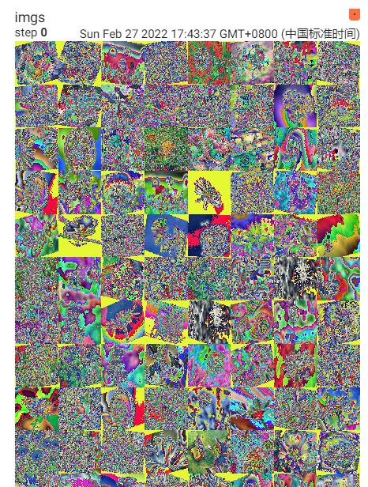
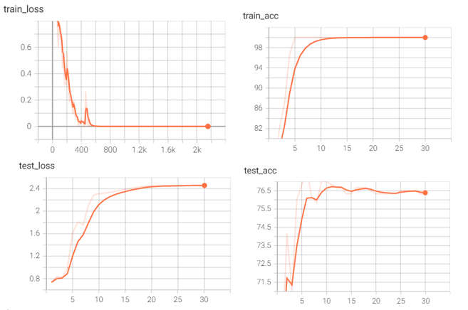

原论文地址：https://www.researchgate.net/publication/323419312

我不是人工智能专业的，大学也仅仅开了《机器学习》和《人工智能》选修课，并没有接触过比较深的课程，但是我对这个领域非常好奇，最近找到了唐老师的一篇论文，用所学的知识进行了简单的复现。

由于理论知识的缺乏和对pytorch掌握不够，其中的随机池化（stochastic pooling），目前我无法实现，只能使用torch自带的模块进行模型的搭建。


### 开发环境
由于本科是做大数据的，经常需要集群，一套大数据服务下来内存动不动占用20G+，所以内存直接给到了32G，但是测试跑深度模型内存占不了太多，比较影响训练速度的是显卡，其中我的显卡3060 Laptop，功耗130W，6G显存，3840个cuda核心，算力49左右，跑模型足够用。
* 操作系统：win11
* cpu：i7-11800H
* 显卡：3060 Laptop（6G）
* 内存：32G
* cuda版本：11.6
* python版本：3.6.9
* pytorch版本：1.9


```python
# -*- coding:utf-8 -*-
import os
import torch
import torch.nn as nn
import torch.nn.functional as F
import torch.optim as optim
from torch.utils.data import Dataset
from torchvision import datasets, transforms, models
from torchsummary import summary
from torch.utils.tensorboard import SummaryWriter
from data_augmentation import data_enhance_rotate, data_enhance_gamma
# 使用GPU训练，3060 Laptop显卡，30个epoch一共需要不到半小时
DEVICE = torch.device("cuda" if torch.cuda.is_available() else "cpu")
```

### 制作数据集
没有原文茶叶数据集，所以我就在kaggle上搜索了相似的花分类数据集

kaggle地址在：https://www.kaggle.com/alxmamaev/flowers-recognition?select=flowers

其中有五类花共4317个图片，只采用了3类，只选取900张图片

其中训练集共有300张，三类分别各有100张

测试集共有600张，三类各有200张

经过数据增强（角度变换9000张 + 伽马纠正9000张 + 原始数据300张）后，训练集共有18300张 （原文没有用原始300张数据，并且原文用了五个数据增强的方法）

数据增强函数在[data_augmentation.py](./data_augmentation.py)中

同时对图片应用了归一化和缩放为256x256大小，至于三个通道的均值和标准差为什么用[0.485, 0.456, 0.406], [0.229, 0.224, 0.225]，参考了网上的回答
https://stackoverflow.com/questions/58151507/why-pytorch-officially-use-mean-0-485-0-456-0-406-and-std-0-229-0-224-0-2

数据集目录树：

    datasets

    +---test_data
    
    |   +---daisy
    
    |   +---dandelion
    
    |   \---rose
    
    \---train_data
    
        +---daisy
        
        +---dandelion
        
        \---rose
        


```python
data_dir = './datasets'
BATCH_SIZE = 256  # 256实测占用4-5G显存
data_transforms = {
    'train_data': transforms.Compose([
        transforms.Resize((256, 256)),
        transforms.ToTensor(),
        transforms.Normalize([0.485, 0.456, 0.406], [0.229, 0.224, 0.225])  # 均值，标准差
        # transforms.Normalize([0.5, 0.5, 0.5], [0.5, 0.5, 0.5])  # 均值，标准差
    ]),
    'test_data': transforms.Compose([
        transforms.Resize((256, 256)),
        transforms.ToTensor(),
        transforms.Normalize([0.485, 0.456, 0.406], [0.229, 0.224, 0.225])
    ]),
}
image_datasets = {x: datasets.ImageFolder(os.path.join(data_dir, x), data_transforms[x]) for x in
                  ['train_data', 'test_data']}
# 300张原始数据，用于后面验证训练集
origin_train_loader = torch.utils.data.DataLoader(image_datasets.get("train_data"), batch_size=BATCH_SIZE, shuffle=True)
print("origin_train: ", len(origin_train_loader.dataset))
# 旋转图片，从-15度到15度，每次递增1，跳过0度，一共产生9000张
image_datasets['train_data'] += data_enhance_rotate(data_dir)
# 伽马纠正，从0.7到1.3，每次递增0.02，总共30次，一共产生9000张
image_datasets['train_data'] += data_enhance_gamma(data_dir)
train_loader = torch.utils.data.DataLoader(image_datasets.get("train_data"), batch_size=BATCH_SIZE, shuffle=True)
test_loader = torch.utils.data.DataLoader(image_datasets.get("test_data"), batch_size=BATCH_SIZE, shuffle=True)
# train_loader一共18300数据，test_loader一共600数据
print("train_loader: ", len(train_loader.dataset))
print("test_loader: ", len(test_loader.dataset))
```

    origin_train:  300
    train_loader:  18300
    test_loader:  600
    

### 查看数据


```python
writer = SummaryWriter("./logs")
# 查看第一批的数据集，总共256张，（256, 3, 256, 256），其中图片顺序已打乱
for imgs, labels in train_loader:
    writer.add_images("imgs", imgs)
    break
writer.close()
```



### 模型搭建
按照原文进行模型搭建，随机池化我没有实现，就用torch自带的最大池化代替了

其中有五层卷积和5层池化层，还有两层全连接，激活函数使用relu，最后使用softmax求概率

模型一共1,627,563个参数


```python

"""
    原文中的网络模型，不过随机池化没有实现
"""
class CNN_SP(nn.Module):
    def __init__(self):
        super().__init__()
        # 下面的卷积层Conv2d的第一个参数指输入通道数，第二个参数指输出通道数，第三个参数指卷积核的大小
        self.conv1 = nn.Conv2d(3, 40, 3, stride=3, padding=1)
        self.conv2 = nn.Conv2d(40, 80, 5, stride=3, padding=0)
        self.conv3 = nn.Conv2d(80, 120, 3, stride=3, padding=1)
        self.conv4 = nn.Conv2d(120, 120, 3, stride=1, padding=1)
        self.conv5 = nn.Conv2d(120, 120, 3, stride=1, padding=1)
        # 原文中dropout的比率为0.1，防止过拟合
        self.dropout_layer = torch.nn.Dropout(0.1)
        # 下面的全连接层Linear的第一个参数指输入通道数，第二个参数指输出通道数
        self.fc1 = nn.Linear(120 * 10 * 10, 100)
        self.fc2 = nn.Linear(100, 3)

    def forward(self, x):
        in_size = x.size(0)
        out = self.conv1(x)
        out = F.relu(out)
        out = F.max_pool2d(out, 3, 1, 1)
        # out = self.pool1(out)
        out = self.conv2(out)
        out = F.relu(out)
        out = F.max_pool2d(out, 3, 1, 1)
        # out = self.pool2(out)
        out = self.conv3(out)
        out = F.relu(out)
        out = F.max_pool2d(out, 3, 1, 1)
        # out = self.pool3(out)
        out = self.conv4(out)
        out = F.relu(out)
        out = F.max_pool2d(out, 3, 1, 1)
        # out = self.pool4(out)
        out = self.conv5(out)
        out = F.relu(out)
        out = F.max_pool2d(out, 3, 1, 1)
        # out = self.pool5(out)
        out = out.view(in_size, -1)
        out = self.fc1(out)
        out = F.relu(out)
        out = self.dropout_layer(out)
        out = self.fc2(out)
        out = F.log_softmax(out, dim=1)  # 计算log(softmax(x))
        return out


# model = StochasticPooling().to(DEVICE)
model = CNN_SP().to(DEVICE)
# summary(model, (40, 86, 86))
summary(model, (3, 256, 256))
```

    E:\python_venv\torch_venv\lib\site-packages\torch\nn\functional.py:718: UserWarning: Named tensors and all their associated APIs are an experimental feature and subject to change. Please do not use them for anything important until they are released as stable. (Triggered internally at  ..\c10/core/TensorImpl.h:1156.)
      return torch.max_pool2d(input, kernel_size, stride, padding, dilation, ceil_mode)
    

    ==========================================================================================
    Layer (type:depth-idx)                   Output Shape              Param #
    ==========================================================================================
    ├─Conv2d: 1-1                            [-1, 40, 86, 86]          1,120
    ├─Conv2d: 1-2                            [-1, 80, 28, 28]          80,080
    ├─Conv2d: 1-3                            [-1, 120, 10, 10]         86,520
    ├─Conv2d: 1-4                            [-1, 120, 10, 10]         129,720
    ├─Conv2d: 1-5                            [-1, 120, 10, 10]         129,720
    ├─Linear: 1-6                            [-1, 100]                 1,200,100
    ├─Dropout: 1-7                           [-1, 100]                 --
    ├─Linear: 1-8                            [-1, 3]                   303
    ==========================================================================================
    Total params: 1,627,563
    Trainable params: 1,627,563
    Non-trainable params: 0
    Total mult-adds (M): 106.47
    ==========================================================================================
    Input size (MB): 0.75
    Forward/backward pass size (MB): 3.01
    Params size (MB): 6.21
    Estimated Total Size (MB): 9.97
    ==========================================================================================
    


    ==========================================================================================
    Layer (type:depth-idx)                   Output Shape              Param #
    ==========================================================================================
    ├─Conv2d: 1-1                            [-1, 40, 86, 86]          1,120
    ├─Conv2d: 1-2                            [-1, 80, 28, 28]          80,080
    ├─Conv2d: 1-3                            [-1, 120, 10, 10]         86,520
    ├─Conv2d: 1-4                            [-1, 120, 10, 10]         129,720
    ├─Conv2d: 1-5                            [-1, 120, 10, 10]         129,720
    ├─Linear: 1-6                            [-1, 100]                 1,200,100
    ├─Dropout: 1-7                           [-1, 100]                 --
    ├─Linear: 1-8                            [-1, 3]                   303
    ==========================================================================================
    Total params: 1,627,563
    Trainable params: 1,627,563
    Non-trainable params: 0
    Total mult-adds (M): 106.47
    ==========================================================================================
    Input size (MB): 0.75
    Forward/backward pass size (MB): 3.01
    Params size (MB): 6.21
    Estimated Total Size (MB): 9.97
    ==========================================================================================


### 自适应学习率，优化器的配置
* 学习率：开始0.01，每10个epch就将lr减少10倍，测试了每3个epoch减少一次lr比固定lr准确率高了5%，但是10个epoch减少一次lr不知为何准确率上不去
* 优化器：相比较SGDM与Adam，Adam拟合速度比较快，但最终结果差不多


```python
def get_optim(model):
    start_lr = 0.01
    # 原文使用的SGD，动量为0.9，可以跟Adam进行比较
    optimizer = optim.SGD(model.parameters(), lr=start_lr, momentum=0.9)
    # optimizer = optim.Adam(model.parameters(), lr=start_lr)
    return optimizer
'''
    自适应学习率，复现原文中的每10个epoch将学习率减少10倍
'''
def adjust_learning_rate(optimizer, epoch, start_lr):
    lr = start_lr * (0.1 ** (epoch // 10))
    for param_group in optimizer.param_groups:
        param_group['lr'] = lr
```

### 训练与测试函数


```python
def train(model, device, train_loader, optimizer, epoch, writer):
    model.train()
    # 自适应学习率
    start_lr = 0.01
    adjust_learning_rate(optimizer, epoch, start_lr)
    for batch_idx, (data, target) in enumerate(train_loader):
        data, target = data.to(device), target.to(device)
        optimizer.zero_grad()
        output = model(data)
        # 原文使用了cross_entropy损失函数，可以与nll_loss进行比较
        loss = F.cross_entropy(output, target)
        # loss = F.nll_loss(output, target)
        loss.backward()
        optimizer.step()
        # 每10个batch后就打印下信息，并写入tensorboard
        if (batch_idx + 1) % 10 == 0:
            print('Train Epoch: {} [{}/{} ({:.0f}%)]\tLoss: {:.6f} \tLr:{:.2E}'.format(
                epoch, batch_idx * len(data), len(train_loader.dataset),
                       100. * batch_idx / len(train_loader), loss.item(),
                optimizer.state_dict()['param_groups'][0]['lr']))
            writer.add_scalar('train_loss', loss.item(), (epoch - 1) * len(train_loader) + batch_idx)
    train_val(model, device, origin_train_loader, epoch, writer)
def train_val(model, device, train_loader, epoch, writer):
    model.eval()
    train_loss = 0
    correct = 0
    with torch.no_grad():
        for data, target in train_loader:
            data, target = data.to(device), target.to(device)
            output = model(data)
            train_loss += F.cross_entropy(output, target, reduction='sum').item()  # 将一批的损失相加
            pred = output.max(1, keepdim=True)[1]  # 找到概率最大的下标
            correct += pred.eq(target.view_as(pred)).sum().item()

    train_loss /= len(train_loader.dataset)
    print('\nTrain set: Average loss: {:.4f}, Accuracy: {}/{} ({:.0f}%)\n'.format(
        train_loss, correct, len(train_loader.dataset),
        100. * correct / len(train_loader.dataset)))
    writer.add_scalar('train_acc', 100. * correct / len(train_loader.dataset), epoch)


def test(model, device, test_loader, epoch, writer):
    model.eval()
    test_loss = 0
    correct = 0
    with torch.no_grad():
        for data, target in test_loader:
            data, target = data.to(device), target.to(device)
            output = model(data)
            test_loss += F.cross_entropy(output, target, reduction='sum').item()  # 将一批的损失相加
            pred = output.max(1, keepdim=True)[1]  # 找到概率最大的下标
            correct += pred.eq(target.view_as(pred)).sum().item()

    test_loss /= len(test_loader.dataset)
    print('\nTest set: Average loss: {:.4f}, Accuracy: {}/{} ({:.0f}%)\n'.format(
        test_loss, correct, len(test_loader.dataset),
        100. * correct / len(test_loader.dataset)))
    writer.add_scalar('test_acc', 100. * correct / len(test_loader.dataset), epoch)
    writer.add_scalar('test_loss', test_loss, epoch)
```

### 开始训练


```python
def start(epochs, model, device, train_loader):
    # tensorboard, 记录loss和acc
    writer = SummaryWriter("./logs")
    optimizer = get_optim(model)
    for epoch in range(1, epochs + 1):
        train(model, device, train_loader, optimizer, epoch, writer)
        test(model, device, test_loader, epoch, writer)
    writer.close()
start(30, model, DEVICE, train_loader)
```

### 训练过程可视化
从上到下，从左往右三图依次是训练集的loss变化、训练集准确率变化、测试集的loss变化、测试集的正确率变化。


### 总结
* 即使训练集数据量不大，仅仅300张训练集，也可用各种数据增强的方法进行训练，并且模型得到不错的表现
* 测试集的正确率基本在第10个epoch(77%)就开始下降了
* 训练集的loss在不断下降最终趋于0，训练集准确率到了100%，但测试集的loss值在不断上升，准确率不到80，即过拟合了
* 最高一次准确率在81%，是自适应学习率每3个epoch减少10倍，但是lr要有个下限，不然30个epoch会让lr变的非常小
* 测试了多个BATCHSIZE, 经测试BATCHSIZE为256时，效果不如小点好


```python
# jupyterlab里 tab + shift 可以看方法的使用
# 测试一下AlexNet
res_model = models.alexnet()
# summary(res_model, (3, 256, 256))
# 最后一层输入4096，输出3
res_model.classifier[6] = nn.Linear(res_model.classifier[6].in_features, 3)
print(res_model.classifier)
# 需要把模型to到Gpu，不然会报错 Input type (torch.cuda.FloatTensor) and weight type (torch.FloatTensor) should be the same
res_model = res_model.to(DEVICE)
```

    Sequential(
      (0): Dropout(p=0.5, inplace=False)
      (1): Linear(in_features=9216, out_features=4096, bias=True)
      (2): ReLU(inplace=True)
      (3): Dropout(p=0.5, inplace=False)
      (4): Linear(in_features=4096, out_features=4096, bias=True)
      (5): ReLU(inplace=True)
      (6): Linear(in_features=4096, out_features=3, bias=True)
    )
    


```python
# AlexNet测试
start(5, res_model, DEVICE, train_loader)
```


```python
torch.cuda.empty_cache()
```


```python

```
